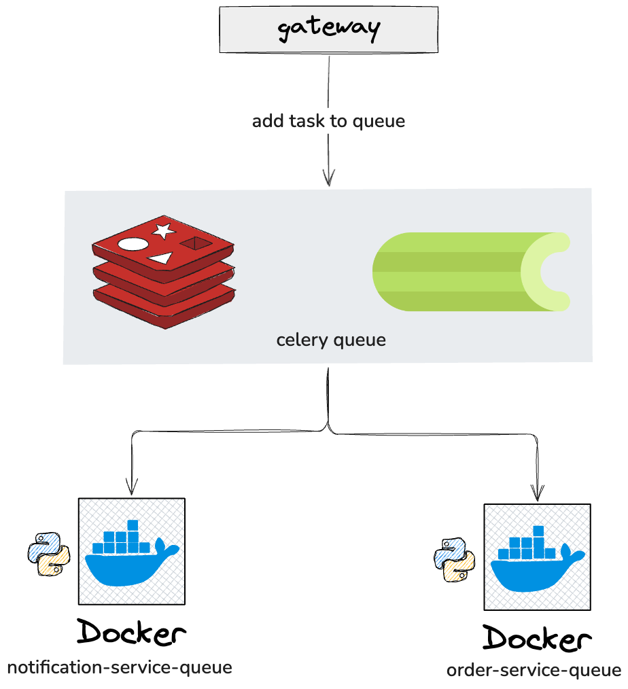

# Microservice with Celery and Redis

## Description

This is a simple microservice that uses Celery and Redis to handle background tasks.
The service exposes an API endpoint that allows users to submit tasks, which are then processed asynchronously by Celery
workers.

## Run workers

To run the Celery workers, use the following command:

```bash
./run_workers.sh
```

## Run Gateway

To run the API gateway, use the following command:

```bash

uv venv && uv sync
cd gateway
uv run fastapi dev
```

## Architecture Diagram

